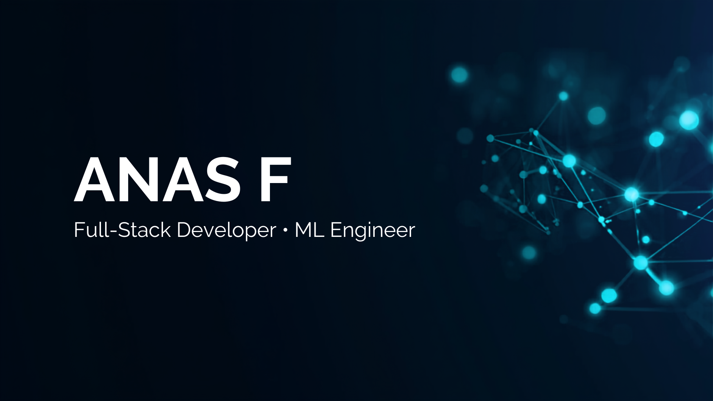
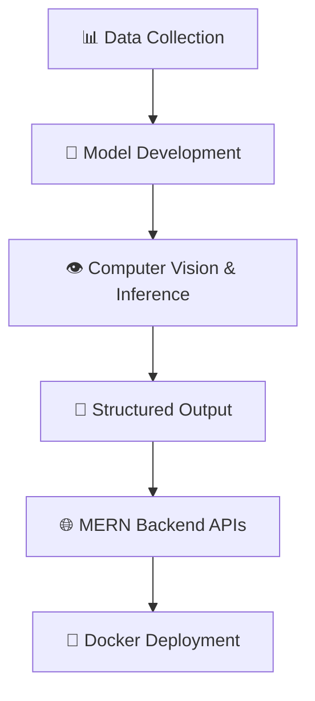

  

  

<h1 align="center">Hi there, I'm Anas F 👋</h1>

  

  Building Scalable Applications • Exploring MLOps • Solving Algorithmic Problems

  
  
  

---

## 🚀 About Me

I am a **Computer Science and Business Systems (CSBS)** undergraduate with a strong foundation in both core software engineering and business workflow principles. I bridge the gap between technical execution and business impact, specializing in full-stack development, machine learning, and MLOps.

- 🤖 **ML & MLOps:** Building robust end-to-end machine learning pipelines with reproducible model versioning, computer vision systems, and containerized deployments.
- 🌐 **Full-Stack Development:** Developing scalable, secure web applications using the MERN stack with modern authentication and clean API design.
- 🐳 **DevOps & Infrastructure:** Optimizing developer workflows using Docker, Git/GitHub, and deploying systems for high reliability.
- 🧮 **Algorithmic Problem Solving:** Passionate about Data Structures and Algorithms with 1,000+ challenges solved across platforms.

---

## 🛠️ Tech Stack

### 💻 Languages

  

### 🌐 Web Development

  

### ⚙️ MLOps, DevOps & Tools

  

---

## 🌟 Featured Projects

### 🏙️ Intelligent Urban Resilience Infrastructure
**Tech Stack:** `Python` • `MLOps` • `Docker`
- Implemented reproducible data and training pipelines incorporating version control for models, dataset lineage, and model validation.
- Containerized the entire workflow using **Docker** to enable seamless, cross-platform local development and cloud-ready MLOps deployments.

### 👁️ Real-Time ANPR System
**Tech Stack:** `YOLOv8` • `OpenCV` • `EasyOCR`
- Developed a high-accuracy vehicle license plate detection model utilizing **YOLOv8** and integrated it with an **EasyOCR** text extraction pipeline.
- Implemented advanced **OpenCV** image preprocessing (thresholding, noise reduction) to achieve robust character recognition under varying lighting conditions at **NIELIT Calicut**.

### 🌱 BioFund Connect – ESG Platform
**Tech Stack:** `MERN Stack` • `JWT` • `MongoDB`
- Designed and built an ESG (Environmental, Social, and Governance) crowdfunding and compliance portal using the **MERN** stack.
- Engineered secure RESTful APIs with stateful user sessions via **JWT** and implemented modular, reusable React components with responsive styling.

---

## ⚙️ Development Workflow

---

## 🏆 Hackathons & Achievements

- **🚀 StartupTN Ecospark '25** — *Finalist* | Competed and presented an entrepreneurial tech solution at the state level.
- **🛡️ ZeroDay 24-Hour Hackathon** — *Finalist* | Developed a secure, scalable software prototype under intense time constraints.
- **🧠 GenAI 24-Hour Hackathon** — *Top 10 Finalist* | Engineered an AI-driven application leveraging modern large language models.
- **🎯 SkillRack** — *1,000+ Problems Solved* | Solved algorithmic and logical reasoning challenges, earning **279+ bronze badges**.
- **💡 LeetCode** — *100+ DSA Problems Solved* | Actively solving data structures and algorithms challenges to hone analytical skills.

---

## 📈 Coding Profiles

  
  
  

---

## 📊 GitHub Analytics

  
  

  

---

## 🤝 Let's Connect

I'm always open to collaborating on projects related to:
* Machine Learning & MLOps
* Computer Vision
* Full-Stack Development
* Open Source Contributions

  

  

